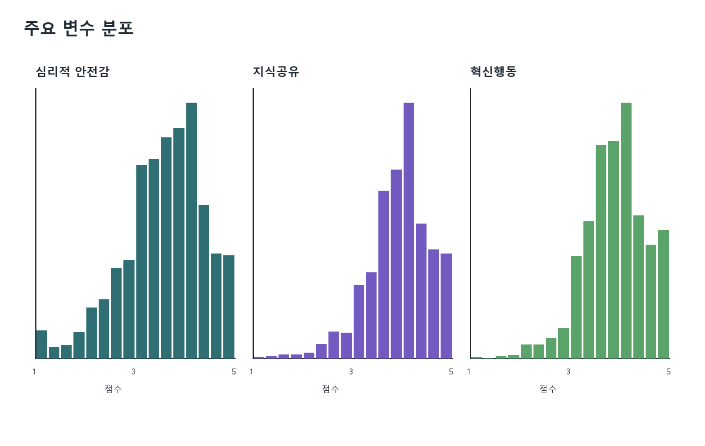
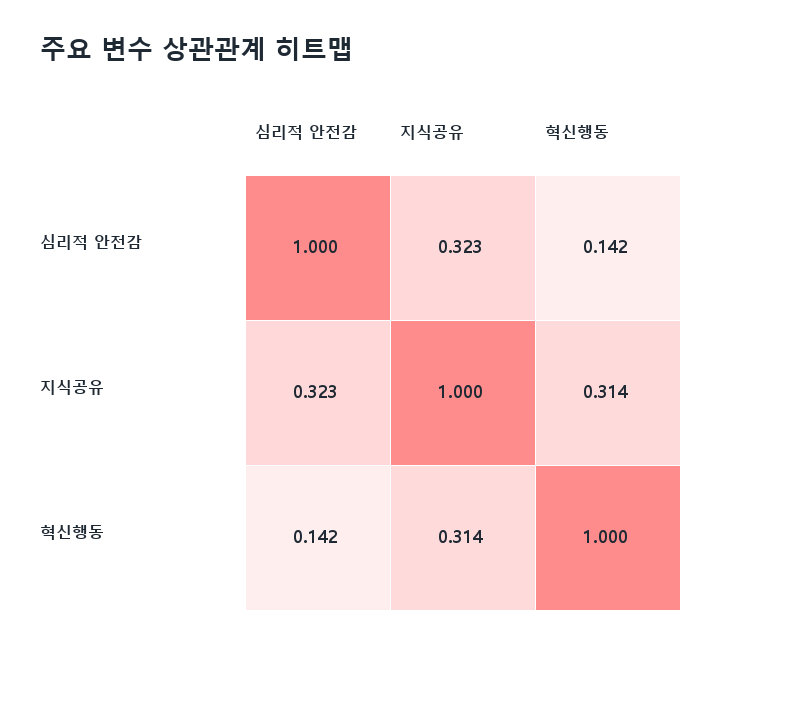
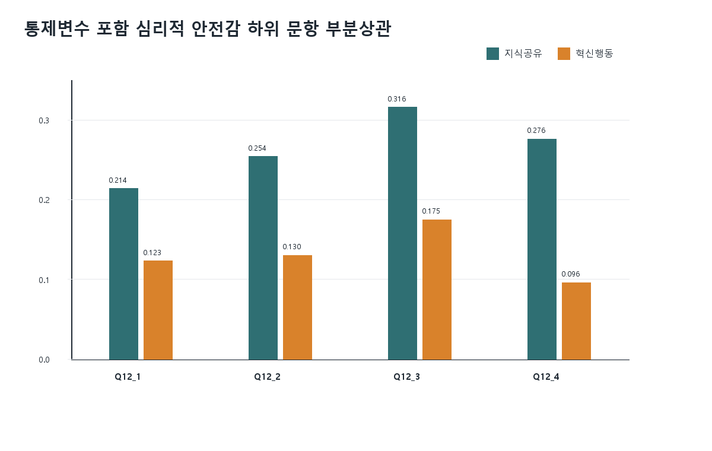
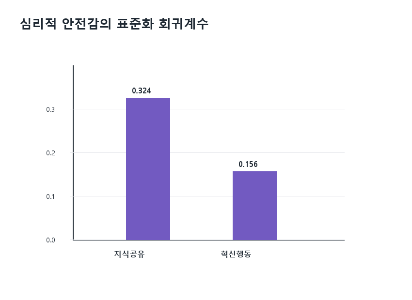

# 심리적 안전감이 지식공유와 혁신행동에 미치는 영향 - 분석 보고서

## 참고사항

이 저장소는 KIRD 「과학기술 인재개발 활동조사」 재직자 데이터를 활용하여 심리적 안전감이 지식공유와 혁신행동에 미치는 영향을 분석하는 소규모 분석 프로젝트입니다.

- 원자료 엑셀 파일은 데이터 사용 제한 가능성이 있어 저장소에 포함하지 않습니다.
- 분석 실행 후 생성되는 CSV 파일은 `processed/`에 저장됩니다.
- 그래프 이미지는 `processed/figures/`에 저장됩니다.
- README의 수치는 `scripts/06_generate_readme.py`가 실제 분석 결과 CSV를 읽어 작성합니다.
- 다른 컴퓨터에서 실행할 경우 `data/raw_data.xlsx`를 두거나 환경변수 `KIRD_RAW_DATA`를 지정해야 합니다.

실행 순서는 아래와 같습니다.

```powershell
python scripts\01_load_and_preprocess.py
python scripts\02_reliability_and_descriptive.py
python scripts\03_correlation.py
python scripts\04_regression_or_modeling.py
python scripts\05_visualization.py
python scripts\06_generate_readme.py
```

## 폴더 구조

| 경로 | 설명 |
|---|---|
| `data/` | 원자료 위치 안내. 원자료는 GitHub 업로드 제외 |
| `scripts/` | 번호 순서대로 실행 가능한 분석 스크립트 |
| `processed/` | 전처리 데이터와 분석 결과 CSV 저장 위치 |
| `processed/figures/` | 주요 시각화 이미지 저장 위치 |
| `README.md` | 분석 보고서 |
| `requirements.txt` | 재현 실행에 필요한 Python 패키지 목록 |

## 환경 준비

- Python 버전: `3.12.13`에서 검증
- 주요 패키지: pandas, numpy, scipy, statsmodels, openpyxl, pillow

패키지 설치:

```bash
pip install -r requirements.txt
```

## 분석 파이프라인

| 실행 순서 | 스크립트 | 역할 | 주요 산출물 |
|---:|---|---|---|
| 1 | `scripts/01_load_and_preprocess.py` | 데이터 로드, 컬럼 매핑, 결측 제거, 척도 평균 생성, 통제변수 더미 인코딩 | `processed/preprocessed_data.csv`, `processed/column_mapping.csv`, `processed/preprocess_summary.csv` |
| 2 | `scripts/02_reliability_and_descriptive.py` | 신뢰도 및 기술통계 계산 | `processed/reliability.csv`, `processed/descriptive_statistics_main.csv`, `processed/descriptive_statistics_items.csv` |
| 3 | `scripts/03_correlation.py` | Pearson 상관, 하위 문항 상관, 통제변수 포함 부분상관 | `processed/correlation_scales_matrix.csv`, `processed/partial_correlation_psych_safety_items_outcomes_controls.csv` |
| 4 | `scripts/04_regression_or_modeling.py` | 위계적 다중회귀 및 하위 문항 회귀분석 | `processed/regression_model_fit.csv`, `processed/regression_coefficients.csv` |
| 5 | `scripts/05_visualization.py` | 주요 그래프 생성 | `processed/figures/*.png` |
| 6 | `scripts/06_generate_readme.py` | 분석 결과 CSV를 읽어 README 보고서 생성 | `README.md` |

전처리 요약:

| item | value | note |
| --- | --- | --- |
| raw_rows | 2000 | 원자료 응답자 수 |
| analysis_rows | 2000 | 결측 제거 후 분석 표본 |
| removed_rows | 0 | 분석 변수 결측으로 제거된 행 |
| reverse_coding | 0 | 확인된 역문항 없음 |
| scale_variables_created | 3 | 문항 평균 척도 수 |
| dummy_variables_created | 7 | 통제변수 더미 수 |

## 1. 변수 선정

| 구분 | 원본 컬럼명 | 분석용 변수명 | 척도 또는 타입 | 선정 이유 |
|---|---|---|---|---|
| 독립변수 | `Q12_1`, `Q12_2`, `Q12_3`, `Q12_4` | `psych_safety` | 1~5점 문항 평균 | 조직 내 심리적 안전감 수준 측정 |
| 종속변수 | `Q19_7`, `Q19_8`, `Q19_9`, `Q19_10` | `knowledge_sharing` | 1~5점 문항 평균 | 동료 간 지식공유 행동 측정 |
| 종속변수 | `Q28_4`, `Q28_5`, `Q28_6`, `Q28_7` | `innovative_behavior` | 1~5점 문항 평균 | 업무 개선과 새로운 아이디어 적용 행동 측정 |
| 통제변수 | `SQ1` | `gender` | 범주형 더미 인코딩 | 성별 차이 통제 |
| 통제변수 | `SQ2_1` | `age_group` | 범주형 더미 인코딩 | 연령대 차이 통제 |
| 통제변수 | `SQ3` | `org_type` | 범주형 더미 인코딩 | 기관 유형 차이 통제 |
| 통제변수 | `QT1` | `job_type` | 범주형 더미 인코딩 | 연구개발직/연구지원직 차이 통제 |

역문항 처리는 적용하지 않았습니다. 현재 제공된 문항명 기준으로 명시적인 역문항이 확인되지 않았으므로, 추가 검토 필요 항목으로 남깁니다.

## 2. 이론적 배경 및 분석 가설

사용자가 제공한 공모문과 조사 개요에 따르면 이 데이터는 과학기술 분야 재직자의 인재개발 활동, 개인 특성, 조직 환경, 성과 변수를 포함합니다. 본 프로젝트는 그중 심리적 안전감, 지식공유, 혁신행동의 관계에 초점을 둡니다.

- 가설 1: 심리적 안전감은 지식공유에 정적인 영향을 미칠 것이다.
- 가설 2: 심리적 안전감은 혁신행동에 정적인 영향을 미칠 것이다.
- 가설 3: 성별, 연령대, 기관 유형, 직무구분을 통제한 뒤에도 심리적 안전감의 영향은 유지될 것이다.

심리적 안전감과 혁신행동의 이론적 연결에 대한 외부 선행연구 인용은 본 프로젝트 범위에서 별도로 수집하지 않았습니다. 따라서 참고문헌 보강은 추가 검토 필요입니다.

## 3. 신뢰도 분석

| scale | label | items | n_items | cronbach_alpha | judgment |
| --- | --- | --- | --- | --- | --- |
| psych_safety | 심리적 안전감 | Q12_1, Q12_2, Q12_3, Q12_4 | 4 | 0.867 | 양호 |
| knowledge_sharing | 지식공유 | Q19_7, Q19_8, Q19_9, Q19_10 | 4 | 0.795 | 수용 가능 |
| innovative_behavior | 혁신행동 | Q28_4, Q28_5, Q28_6, Q28_7 | 4 | 0.815 | 양호 |

세 척도의 Cronbach's alpha는 모두 0.70 이상으로 나타났습니다. 따라서 문항 평균을 척도 점수로 사용하는 것은 수용 가능하다고 판단했습니다.

## 4. 기술통계 분석

### 4.1 독립변수 및 종속변수

| variable | label | count | mean | std | min | max | skew | kurtosis | missing_count |
| --- | --- | --- | --- | --- | --- | --- | --- | --- | --- |
| psych_safety | 심리적 안전감 | 2000.000 | 3.457 | 0.817 | 1.000 | 5.000 | -0.613 | 0.367 | 0 |
| knowledge_sharing | 지식공유 | 2000.000 | 3.822 | 0.621 | 1.000 | 5.000 | -0.569 | 0.893 | 0 |
| innovative_behavior | 혁신행동 | 2000.000 | 3.792 | 0.622 | 1.000 | 5.000 | -0.320 | 0.433 | 0 |

주요 변수의 평균은 모두 3점 이상으로 나타났습니다. 왜도는 음수 방향으로 나타나 높은 점수 쪽 응답이 상대적으로 많은 편입니다. 첨도는 과도하게 크지 않아 극단적인 분포 문제는 크지 않은 것으로 보입니다.

### 4.2 문항 수준 기술통계

| variable | label | count | mean | std | min | max | skew | kurtosis | missing_count |
| --- | --- | --- | --- | --- | --- | --- | --- | --- | --- |
| Q12_1 | 구성원 실수 책임 공유 | 2000.000 | 3.314 | 0.978 | 1.000 | 5.000 | -0.441 | -0.197 | 0 |
| Q12_2 | 구성원 다양성 존중 | 2000.000 | 3.382 | 0.957 | 1.000 | 5.000 | -0.493 | -0.098 | 0 |
| Q12_3 | 구성원 간 도움 요청의 자유로움 | 2000.000 | 3.496 | 0.969 | 1.000 | 5.000 | -0.471 | -0.134 | 0 |
| Q12_4 | 나의 노력에 대한 존중 | 2000.000 | 3.636 | 0.962 | 1.000 | 5.000 | -0.690 | 0.355 | 0 |
| Q19_7 | 동료들과 새로운 정보 공유 정도 | 2000.000 | 3.806 | 0.769 | 1.000 | 5.000 | -0.498 | 0.385 | 0 |
| Q19_8 | 동료들과 업무에 대한 공유 정도 | 2000.000 | 3.641 | 0.854 | 1.000 | 5.000 | -0.391 | -0.053 | 0 |
| Q19_9 | 특정지식 필요 시, 동료를 통한 습득 | 2000.000 | 3.906 | 0.760 | 1.000 | 5.000 | -0.713 | 1.084 | 0 |
| Q19_10 | 특정 배움 필요 시, 동료에게 가르침 요청 정도 | 2000.000 | 3.936 | 0.772 | 1.000 | 5.000 | -0.645 | 0.697 | 0 |
| Q28_4 | 업무 문제점 해결을 위한 신규 아이디어 개발 | 2000.000 | 3.742 | 0.791 | 1.000 | 5.000 | -0.346 | -0.086 | 0 |
| Q28_5 | 업무 수행에 활용되는 신규 방법 등을 찾으려는 노력 | 2000.000 | 3.920 | 0.755 | 1.000 | 5.000 | -0.474 | 0.304 | 0 |
| Q28_6 | 혁신적 아이디어 공감 | 2000.000 | 3.796 | 0.774 | 1.000 | 5.000 | -0.286 | -0.144 | 0 |
| Q28_7 | 혁신적 아이디어 적용을 위한 노력 | 2000.000 | 3.710 | 0.782 | 1.000 | 5.000 | -0.248 | -0.032 | 0 |

## 5. 상관분석

### 5.1 주요 척도 상관계수

| 변수 | 심리적 안전감 | 지식공유 | 혁신행동 |
| --- | --- | --- | --- |
| 심리적 안전감 | 1.000 | 0.323 | 0.142 |
| 지식공유 | 0.323 | 1.000 | 0.314 |
| 혁신행동 | 0.142 | 0.314 | 1.000 |

심리적 안전감은 지식공유 및 혁신행동과 모두 정적 상관을 보였습니다. 지식공유와 혁신행동 사이에도 정적 상관이 확인되었습니다.

### 5.2 심리적 안전감 하위 문항 상관계수

| 변수 | 구성원 실수 책임 공유 | 구성원 다양성 존중 | 구성원 간 도움 요청의 자유로움 | 나의 노력에 대한 존중 |
| --- | --- | --- | --- | --- |
| 구성원 실수 책임 공유 | 1.000 | 0.691 | 0.558 | 0.581 |
| 구성원 다양성 존중 | 0.691 | 1.000 | 0.621 | 0.647 |
| 구성원 간 도움 요청의 자유로움 | 0.558 | 0.621 | 1.000 | 0.628 |
| 나의 노력에 대한 존중 | 0.581 | 0.647 | 0.628 | 1.000 |

심리적 안전감 하위 문항 간 상관은 전반적으로 중간 이상 수준입니다. 문항 간 관련성이 높지만 0.80을 넘는 수준은 아니므로, 심각한 중복 문항이라고 단정하기는 어렵습니다. 다만 회귀분석에서 하위 문항을 동시에 투입할 경우 다중공선성 가능성은 추가 검토가 필요합니다.

### 5.3 통제변수 포함 부분상관

| predictor | predictor_label | outcome | outcome_label | partial_r | p |
| --- | --- | --- | --- | --- | --- |
| Q12_1 | 구성원 실수 책임 공유 | knowledge_sharing | 지식공유 | 0.214 | < .001 |
| Q12_1 | 구성원 실수 책임 공유 | innovative_behavior | 혁신행동 | 0.123 | < .001 |
| Q12_2 | 구성원 다양성 존중 | knowledge_sharing | 지식공유 | 0.254 | < .001 |
| Q12_2 | 구성원 다양성 존중 | innovative_behavior | 혁신행동 | 0.130 | < .001 |
| Q12_3 | 구성원 간 도움 요청의 자유로움 | knowledge_sharing | 지식공유 | 0.316 | < .001 |
| Q12_3 | 구성원 간 도움 요청의 자유로움 | innovative_behavior | 혁신행동 | 0.175 | < .001 |
| Q12_4 | 나의 노력에 대한 존중 | knowledge_sharing | 지식공유 | 0.276 | < .001 |
| Q12_4 | 나의 노력에 대한 존중 | innovative_behavior | 혁신행동 | 0.096 | < .001 |

성별, 연령대, 소속기관 유형, 직무구분을 더미변수로 통제한 뒤에도 심리적 안전감 하위 문항은 지식공유와 혁신행동에 대체로 유의한 정적 관련을 보였습니다.

## 6. 주요 분석 결과

### 6.1 위계적 다중회귀 모형 설명력

| outcome | model | R2 | Adj_R2 | Delta_R2 | F | F_p | n |
| --- | --- | --- | --- | --- | --- | --- | --- |
| knowledge_sharing | Model 1: controls | 0.009 | 0.005 |  | 2.484 | 0.015 | 2000 |
| knowledge_sharing | Model 2: controls + psych_safety | 0.107 | 0.104 | 0.099 | 29.961 | < .001 | 2000 |
| innovative_behavior | Model 1: controls | 0.062 | 0.059 |  | 18.888 | < .001 | 2000 |
| innovative_behavior | Model 2: controls + psych_safety | 0.085 | 0.081 | 0.023 | 23.152 | < .001 | 2000 |

통제변수만 투입한 모형과 통제변수에 심리적 안전감을 추가한 모형을 비교했습니다. 심리적 안전감 추가 후 지식공유와 혁신행동 모두에서 설명력이 증가했습니다.

### 6.2 심리적 안전감 척도 회귀계수

| outcome | label | B | SE | std_beta | t | p | CI_lower | CI_upper |
| --- | --- | --- | --- | --- | --- | --- | --- | --- |
| knowledge_sharing | 심리적 안전감 | 0.246 | 0.017 | 0.324 | 14.845 | < .001 | 0.214 | 0.279 |
| innovative_behavior | 심리적 안전감 | 0.119 | 0.017 | 0.156 | 7.054 | < .001 | 0.086 | 0.151 |

### 6.3 심리적 안전감 하위 문항 회귀계수

| outcome | term | label | B | SE | std_beta | t | p |
| --- | --- | --- | --- | --- | --- | --- | --- |
| knowledge_sharing | Q12_1 | 구성원 실수 책임 공유 | -0.002 | 0.019 | -0.003 | -0.110 | 0.912 |
| knowledge_sharing | Q12_2 | 구성원 다양성 존중 | 0.038 | 0.022 | 0.058 | 1.745 | 0.081 |
| knowledge_sharing | Q12_3 | 구성원 간 도움 요청의 자유로움 | 0.142 | 0.019 | 0.221 | 7.508 | < .001 |
| knowledge_sharing | Q12_4 | 나의 노력에 대한 존중 | 0.071 | 0.020 | 0.110 | 3.626 | < .001 |
| innovative_behavior | Q12_1 | 구성원 실수 책임 공유 | 0.023 | 0.020 | 0.036 | 1.170 | 0.242 |
| innovative_behavior | Q12_2 | 구성원 다양성 존중 | 0.024 | 0.022 | 0.037 | 1.102 | 0.271 |
| innovative_behavior | Q12_3 | 구성원 간 도움 요청의 자유로움 | 0.103 | 0.019 | 0.160 | 5.345 | < .001 |
| innovative_behavior | Q12_4 | 나의 노력에 대한 존중 | -0.030 | 0.020 | -0.046 | -1.504 | 0.133 |

하위 문항을 동시에 투입한 모형에서는 `Q12_3` 구성원 간 도움 요청의 자유로움이 지식공유와 혁신행동 모두에서 유의한 변수로 나타났습니다.

## 7. 분석 결과 해석

심리적 안전감은 통제변수를 고려한 뒤에도 지식공유와 혁신행동에 유의한 정적 영향을 보였습니다. 특히 지식공유 모형에서 추가 설명력 증가가 더 크게 나타났습니다.

가장 일관되게 영향력이 큰 하위 문항은 `Q12_3` 구성원 간 도움 요청의 자유로움입니다. 이는 과학기술 분야 재직자가 자유롭게 도움을 요청할 수 있는 환경에서 지식공유가 활발해지고, 새로운 아이디어를 시도하는 혁신행동도 높아질 가능성을 시사합니다.

예상과 일치한 결과는 심리적 안전감이 두 종속변수 모두와 정적 관계를 보였다는 점입니다. 예상과 다른 결과 또는 추가 검토가 필요한 결과는 하위 문항 동시 투입 시 일부 문항의 회귀계수가 유의하지 않게 나타난 점입니다. 이는 하위 문항 간 상관이 존재하기 때문일 수 있으므로 다중공선성 진단은 추가 검토가 필요합니다.

실무적 또는 정책적 시사점은 교육훈련 프로그램뿐 아니라 조직 내 질문, 도움 요청, 상호 존중이 가능한 환경을 조성하는 것이 인재개발 성과와 혁신행동을 높이는 데 중요할 수 있다는 점입니다.

## 8. 데이터 출처·한계

- 데이터 출처: 사용자가 제공한 KIRD 「과학기술 인재개발 활동조사」 재직자 데이터
- 표본 한계: 현재 분석은 제공된 재직자 데이터 2,000명에 한정됩니다.
- 변수 한계: 통제변수의 범주명은 코드북을 통해 추가 확인이 필요합니다.
- 분석 방법 한계: 횡단면 설문자료이므로 인과관계를 단정할 수 없습니다.
- 측정 한계: 자기보고식 설문이므로 동일방법편의 가능성이 있습니다.
- 문항 처리 한계: 역문항 여부는 문항명 기준으로 판단했으며, 공식 코드북 대조는 추가 검토 필요입니다.

## 참고문헌 또는 참고자료

- 사용자가 제공한 KIRD 「과학기술 인재개발 활동조사」 데이터 활용 논문 공모문 및 조사 개요
- 추가 작성 필요

## 주요 시각화

**주요 변수 분포**



**주요 변수 상관관계 히트맵**



**심리적 안전감 하위 문항 부분상관**



**심리적 안전감 표준화 회귀계수**



## 문제가 생길 때

| 문제 유형 | 해결 방법 |
|---|---|
| 파일 경로 오류 | 원자료를 `data/raw_data.xlsx`로 복사하거나 PowerShell에서 `$env:KIRD_RAW_DATA = "원자료경로"`를 설정합니다. |
| ModuleNotFoundError | `pip install -r requirements.txt`를 실행합니다. 가상환경을 사용 중이면 활성화 여부를 확인합니다. |
| UnicodeDecodeError | CSV 파일은 `utf-8-sig`로 저장됩니다. 엑셀에서 깨질 경우 데이터 가져오기 기능에서 UTF-8을 선택합니다. |
| 한글 깨짐 | Windows에서는 Malgun Gothic을 사용하도록 설정했습니다. 다른 OS에서는 한글 폰트 설치가 필요할 수 있습니다. |
| 그래프 저장 오류 | `processed/figures/` 폴더 권한을 확인하고, `05_visualization.py`를 다시 실행합니다. |
| 결측치 처리 오류 | `processed/missing_summary_before_drop.csv`를 확인하여 어떤 변수에서 결측이 발생했는지 점검합니다. |
